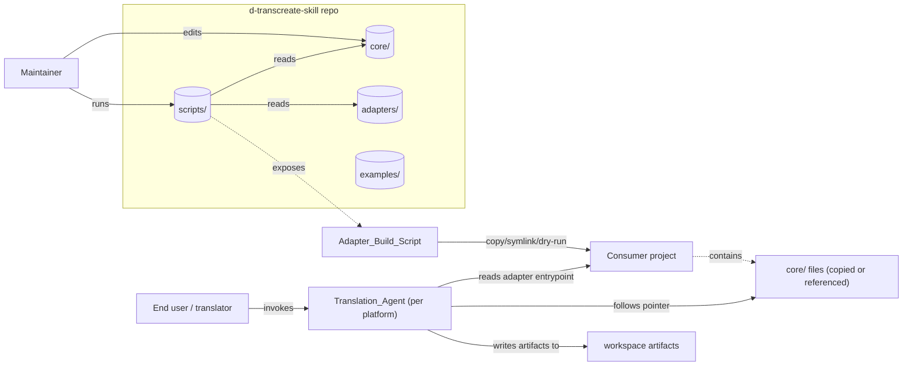
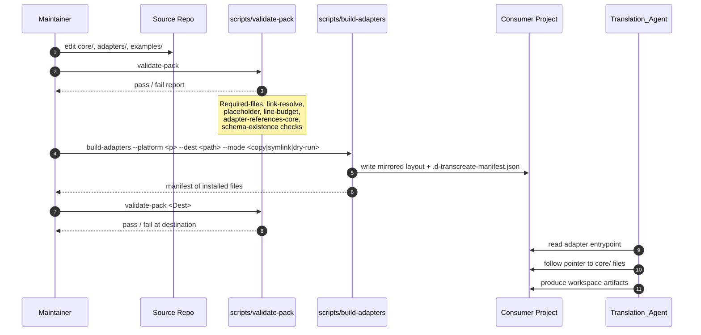
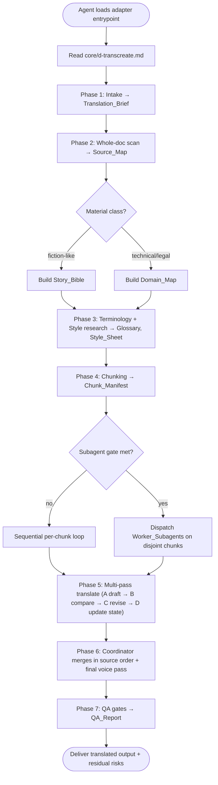
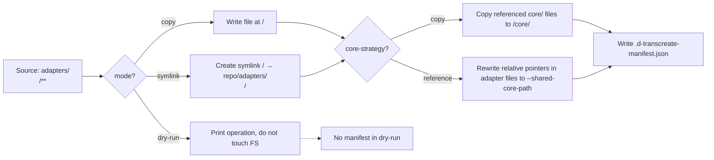
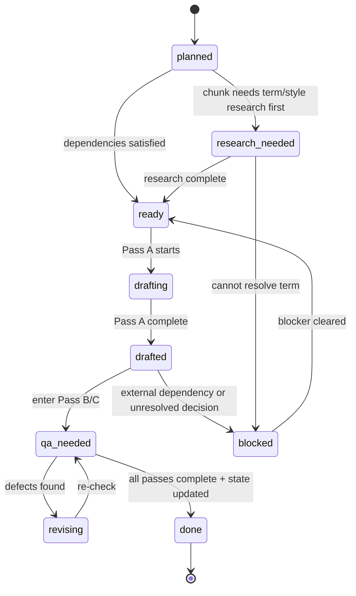
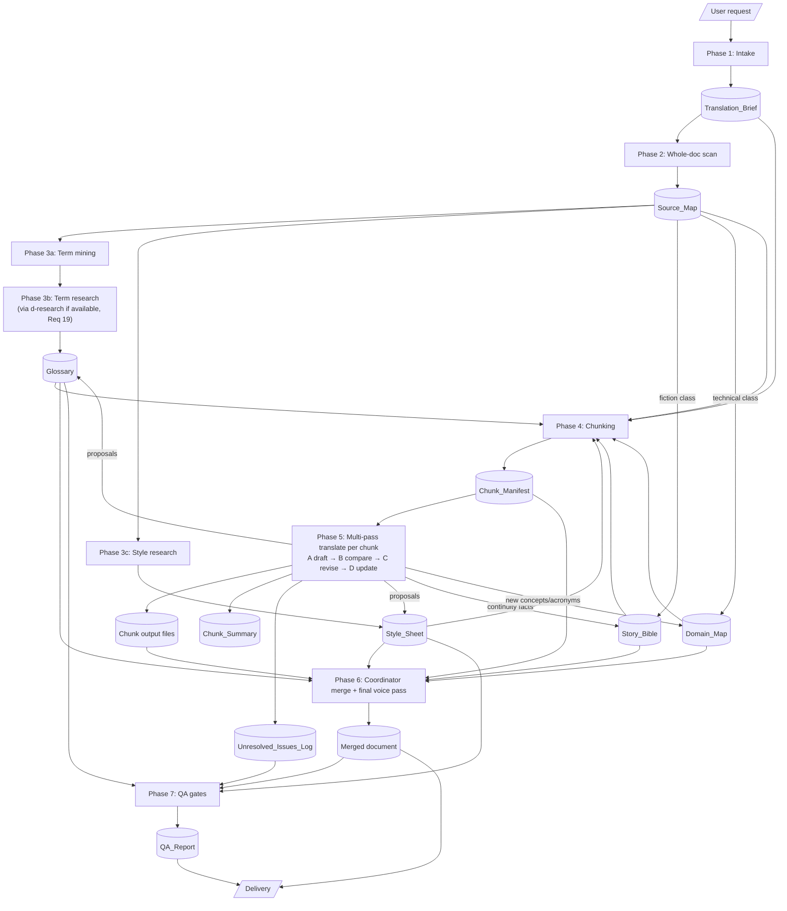
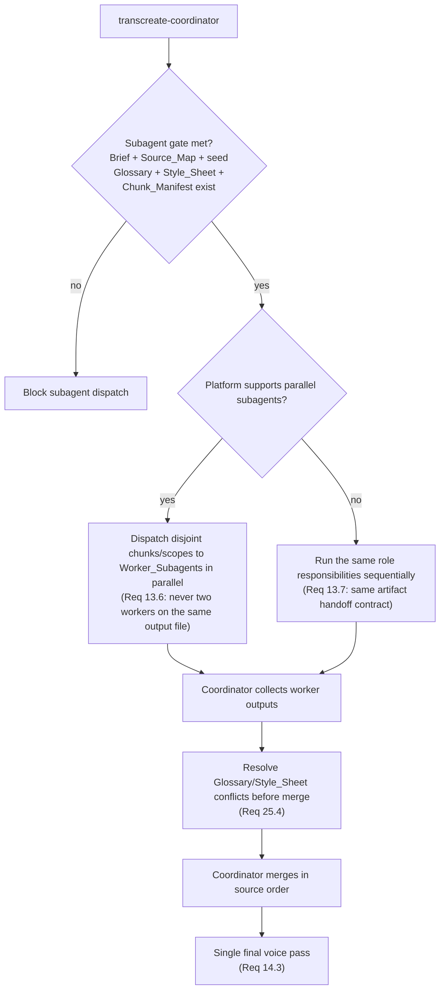
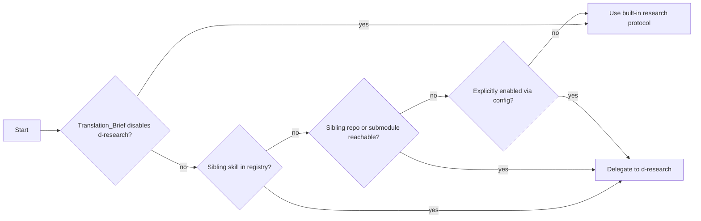

# Design Document

## Overview

`d-transcreate-skill` is an **agent-agnostic skill pack**: a documentation product whose primary consumer is an AI coding/writing agent (Codex, Claude Code, Cursor, OpenCode, or generic) and whose secondary consumers are human translators/clients and pack maintainers. The pack delivers a strict, resumable, copyright-safe, multi-pass translation/transcreation workflow for long documents — fiction, technical manuals, legal/policy material, scripts, subtitles, and mixed-format sources.

The design pursues five non-negotiable invariants:

1. **Single source of truth.** All workflow logic, schemas, and subagent prompts live exactly once under `core/`. Adapter packs are thin pointers, never duplicates. (Req 1, 2)
2. **Mirrored install layout.** Each `adapters/<platform>/` folder is a *template* whose internal paths match the destination project layout, so installation is a copy/symlink/build-script operation rather than a translation step. (Req 3)
3. **Artifact-as-state.** Every long-running decision (brief, glossary, style sheet, story bible, manifest, summaries) is persisted as a file in the consumer workspace. Chat history is never authoritative. (Req 16, 17)
4. **Progressive disclosure.** Entrypoints are short and reference detailed workflow files lazily. An agent never needs the full repo in context to perform any single step. (Req 27)
5. **Copyright safety.** Existing translations may inform terminology and style only as paraphrased observations with short, attributed evidence quotes. No patchwork translation, no extended reproduction. (Req 18)

This design migrates the existing prior-art under `references/`, the prior `agents/openai.yaml`, and the prior root `SKILL.md` into the canonical `core/` and `adapters/codex/` locations defined by Req 1, 2, 3, 20, and 21. The migration is mechanical: prior content is reclassified, not rewritten in substance.

## Architecture

### High-Level Repository Layout

The pack has four top-level concerns: canonical content (`core/`), platform templates (`adapters/`), runnable demonstrations (`examples/`), and maintainer tooling (`scripts/`). Top-level `README.md` and `AGENTS.md` provide the bilingual orientation surface.

```
d-transcreate-skill/
├── README.md                       # Bilingual: EN section then VI section          (Req 4.3, 28.4)
├── README.vi.md                    # Optional locale-suffixed README                 (Req 4.5)
├── AGENTS.md                       # Generic-agent bootstrap at top level            (Req 1.5)
├── LICENSE
├── core/                           # SINGLE SOURCE OF TRUTH                          (Req 1.1, 2)
│   ├── d-transcreate.md            # Canonical entrypoint (≤ ~200 lines)             (Req 2.1, 27.1, 27.2)
│   ├── workflows/                                                                    (Req 2.2)
│   │   ├── long-document.md
│   │   ├── terminology-research.md
│   │   ├── fiction-continuity.md
│   │   ├── technical-domain.md
│   │   ├── qa-gates.md
│   │   ├── context-management.md   # Includes resume procedure                       (Req 16.6, 17.4)
│   │   └── subagents.md
│   ├── schemas/                                                                      (Req 2.3, 21)
│   │   ├── translation-brief.md
│   │   ├── source-map.md
│   │   ├── glossary.md             # CSV column spec + Markdown table form           (Req 21.2)
│   │   ├── style-sheet.md
│   │   ├── story-bible.md
│   │   ├── domain-map.md
│   │   ├── chunk-manifest.md       # CSV column spec + Markdown table form           (Req 21.3)
│   │   ├── chunk-summary.md
│   │   ├── unresolved-issues.md
│   │   └── qa-report.md
│   └── prompts/                                                                      (Req 2.4, 20)
│       ├── transcreate-coordinator.md
│       ├── terminology-researcher.md
│       ├── style-researcher.md
│       ├── chunk-translator.md
│       ├── continuity-reviewer.md
│       ├── fidelity-reviewer.md
│       └── formatting-reviewer.md
├── adapters/                       # TEMPLATE LAYOUTS (mirrored install paths)       (Req 3)
│   ├── codex/
│   │   ├── SKILL.md                                                                  (Req 3.1)
│   │   └── agents/openai.yaml
│   ├── claude-code/
│   │   ├── CLAUDE.md                                                                 (Req 3.2)
│   │   ├── .claude/skills/d-transcreate/SKILL.md
│   │   └── .claude/agents/{role}.md         # one per subagent role                  (Req 20)
│   ├── cursor/
│   │   ├── AGENTS.md                                                                 (Req 3.3, 3.6)
│   │   └── .cursor/rules/d-transcreate.mdc  # Agent-Requested or Manual, never Always
│   ├── opencode/
│   │   ├── AGENTS.md                                                                 (Req 3.4)
│   │   ├── opencode.json                    # references core via `instructions`
│   │   └── .opencode/agents/{role}.md
│   └── generic/
│       ├── AGENTS.md                                                                 (Req 3.5)
│       └── d-transcreate.md
├── examples/                                                                         (Req 1.3, 23)
│   ├── fiction-short/
│   │   ├── README.md
│   │   ├── source/                  # original or permissive-license content only    (Req 23.6)
│   │   └── seed-artifacts/          # seed brief + glossary + style sheet (Req 24.4)
│   ├── technical-manual/
│   │   ├── README.md
│   │   ├── source/
│   │   └── seed-artifacts/
│   └── legal-policy/
│       ├── README.md
│       ├── source/
│       └── seed-artifacts/
└── scripts/                                                                          (Req 1.4, 22, 29)
    ├── validate-pack                # Validation_Script                              (Req 22)
    └── build-adapters               # Adapter_Build_Script                           (Req 29)
```

### Three Audiences, Three Read Paths



The diagram makes three points: maintainers only ever modify `core/`, adapters, examples, and scripts; the build script is the bridge between the source repo and a consumer project; and a Translation_Agent at runtime sees only the adapter entrypoint plus referenced `core/` files, never the full repo. (Req 2.5, 24, 27, 29)

### Author → Build → Consume Lifecycle



The sequence enforces Req 22.7 (non-zero exit on failure), Req 29.7 (manifest), Req 29.8 (validation runnable at destination), and Req 28.1 (validation detects broken references after core changes).

### Control Flow at Translation Runtime



This is the canonical workflow encoded in `core/d-transcreate.md` and `core/workflows/long-document.md`. Subagent gating (Req 13.1) is enforced at the diamond labeled *Subagent gate met?*: the Translation_Brief, Source_Map, seed Glossary, Style_Sheet, Chunk_Manifest, and Story_Bible/Domain_Map must all exist on disk before any Worker_Subagent dispatches.

## Components and Interfaces

### Component 1: Core Library

The Core Library is the only place workflow content is *authored*. Adapters cite it; examples consume it; the build script ships it (or rewrites pointers to it). Its sub-components correspond to the subdirectories under `core/`.

#### 1.1 Entrypoint — `core/d-transcreate.md`

The canonical entrypoint, capped at a configurable line budget (default 200 lines, Req 2.6, 27.2). It contains:

| Section | Purpose | Source content (today) |
|---|---|---|
| Operating principles | Faithfulness, register, mark-uncertainty, no-copyright-copy | Migrated from existing `SKILL.md` "Operating Principles" |
| Core workflow (7 phases) | Intake → Scan → Research → Plan → Translate → Coordinate → QA | Migrated from existing `SKILL.md` "Core Workflow" |
| Subagent role list | Names + one-line scope for the 7 fixed roles | New (Req 20.1) |
| Reference index | Pointers to `core/workflows/*.md` and `core/schemas/*.md` | Migrated from existing `SKILL.md` "Reference Files" |
| Copyright rules | Short canonical statement | Migrated from `references/research-and-style.md` (Req 18.5) |

The entrypoint must NOT contain detailed procedural content; that is delegated to the workflow files (Req 27.1, 27.3).

#### 1.2 Workflows — `core/workflows/`

Each file owns one concern and is loaded only when an agent needs that concern. Mapping from existing references and requirements:

| File | Owns | Migrated from | Required by |
|---|---|---|---|
| `long-document.md` | Phase-by-phase staged workflow, intake contract, source inventory, segmenting, multi-pass translation passes A/B/C/D, merge, delivery | `references/long-document-workflow.md` | Req 5, 6, 11, 12, 14 |
| `terminology-research.md` | Term mining, source priority order, `d-research` integration pattern + fallback, copyright rules for evidence quotes | `references/research-and-style.md` (research portion) | Req 7, 18.5, 19 |
| `fiction-continuity.md` | Story Bible maintenance, reveal-timing rules, character voice, terms of address | New (carved from existing `SKILL.md` fiction notes) | Req 6.4, 9 |
| `technical-domain.md` | Domain Map maintenance, acronym/unit/standard handling, citation preservation | New (carved from existing `SKILL.md` technical notes) | Req 6.5, 10 |
| `qa-gates.md` | The 8 QA gates (completeness, fidelity, terminology, target-language quality, continuity, numbers, formatting, residual risk) | `references/qa-gates.md` | Req 15 |
| `context-management.md` | Context budget rule, what loads per chunk, summary unloading, **resume procedure** | `references/context-and-subagents.md` (context portion) | Req 16, 17 |
| `subagents.md` | Readiness gate, role responsibilities, prompt pattern, parallel rules, coordinator merge checklist | `references/context-and-subagents.md` (subagent portion) | Req 13, 14, 25 |

#### 1.3 Schemas — `core/schemas/`

Each schema file is the single declaration of an artifact's shape. Schema files are referenced — never inlined — by workflow and prompt files (Req 21.4). The validation script verifies that every schema cited from a workflow or prompt exists (Req 21.5, 22).

Required schemas (Req 21.1):

| Schema | Form | Required columns / fields | Migrated from |
|---|---|---|---|
| `translation-brief.md` | Markdown form | source files, source language, target language, target locale, audience, mode, register, output format, formatting constraints, do-not-translate, terminology authority, research depth, QA bar, open questions | `references/artifact-schemas.md` |
| `source-map.md` | Markdown sections + tables | overview (genre, purpose, source quality, hazards), structure table, high-risk items table; plus fiction-specific (cast, POV, timeline, motifs) and technical-specific (domain, standards, acronyms, units) extensions | `references/artifact-schemas.md` + new |
| `glossary.md` | CSV column spec + equivalent Markdown table (Req 21.2) | `term, preferred_translation, forbidden_translation, term_class, context, source_location, evidence, confidence, status, notes`. `status ∈ {proposed, approved, needs-review, deprecated}`, `confidence ∈ {high, medium, low}` (Req 7.3) | `references/artifact-schemas.md` |
| `style-sheet.md` | Markdown sections | voice, language conventions, adaptation rules, forbidden patterns | `references/artifact-schemas.md` |
| `story-bible.md` | Markdown sections + tables | characters, timeline, places, continuity threads, terms of address | `references/artifact-schemas.md` |
| `domain-map.md` | Markdown sections + tables | domain, concepts, acronyms, units and formal-data conventions | `references/artifact-schemas.md` |
| `chunk-manifest.md` | CSV column spec + equivalent Markdown table (Req 21.3) | `chunk_id, source_location, word_or_page_range, semantic_unit, dependencies, assigned_to, status, output_path, qa_status, notes`. `status ∈ {planned, research-needed, ready, drafting, drafted, qa-needed, revising, done, blocked}` (Req 11.6) | `references/artifact-schemas.md` |
| `chunk-summary.md` | Repeating Markdown blocks per chunk_id | source range, what happened/main argument, terms introduced, continuity implications, unresolved issues, next-chunk dependency | `references/artifact-schemas.md` |
| `unresolved-issues.md` | Markdown table | id, location, issue, options, owner, status | `references/artifact-schemas.md` |
| `qa-report.md` | Markdown sections + table | scope, artifacts checked, checks performed, issues table, residual risks | `references/artifact-schemas.md` |

#### 1.4 Subagent Prompts — `core/prompts/`

One file per fixed role (Req 20.9). Each prompt has the same structure:

```
# Role: <role-name>

## Scope
<one paragraph: what this role owns and does NOT own>

## Inputs (loaded by coordinator)
- <bullet list of artifact slices>

## Output contract (structured)
- <bullet list of fields the role MUST return>

## Procedure
<numbered steps>

## Boundaries
<what the role MUST NOT do — e.g., "do not edit the global Glossary directly; propose changes only">
```

The 7 fixed roles and their canonical scopes (Req 20):

| Role | Authority | Touches | Returns |
|---|---|---|---|
| `transcreate-coordinator` | Final say on Glossary, Style_Sheet, voice, continuity, merge | All artifacts (read), Glossary/Style_Sheet/Story_Bible/Domain_Map (write), Chunk_Manifest (write status transitions) | Final merged document, accept/reject decisions on proposals |
| `terminology-researcher` | None — proposes only | Glossary (proposes), Unresolved_Issues_Log (writes) | Glossary proposal rows with evidence and source URL |
| `style-researcher` | None — proposes only | Style_Sheet (proposes) | Style observations with paraphrased rationale and source notes |
| `chunk-translator` | Owns one chunk | One chunk's output file, Chunk_Summary for that chunk, Unresolved_Issues_Log entries scoped to the chunk; proposes Glossary/Style_Sheet edits | Translated chunk + uncertain items + proposed edits + continuity notes |
| `continuity-reviewer` | None — flags only | Unresolved_Issues_Log (writes) | Defect list with chunk_id and source location |
| `fidelity-reviewer` | None — flags only | Unresolved_Issues_Log (writes) | Defect list keyed to source-target paragraph diff |
| `formatting-reviewer` | None — flags only | Unresolved_Issues_Log (writes) | Defect list for tables, footnotes, headings, citations, layout |

Worker authority is intentionally narrow: workers never write the global Glossary or Style_Sheet directly (Req 13.2, 14.4, 25.3, 25.4). They *propose*; the coordinator approves.

### Component 2: Adapter Packs

Each adapter is a **template/source layout** (Req 3.8) whose internal paths mirror the destination project layout (Req 3.9). Installation is *path-preserving*: `adapters/cursor/.cursor/rules/d-transcreate.mdc` becomes `<dest>/.cursor/rules/d-transcreate.mdc` (Req 3.10).

A common contract applies to every adapter (Req 2.5, 2.6, 27.4):

- The entrypoint is **English** (Req 4.2).
- The entrypoint stays within the configurable line budget.
- The entrypoint references at least one file under `core/` (by relative path or explicit pointer).
- The entrypoint never duplicates workflow text from `core/`.

#### 2.1 Codex Adapter — `adapters/codex/`

| File | Role | Notes |
|---|---|---|
| `SKILL.md` | Codex-style skill entrypoint with YAML frontmatter (`name`, `description`) | Migrated from existing root `SKILL.md`; trimmed to bootstrap + pointers (Req 3.1) |
| `agents/openai.yaml` | OpenAI-style interface descriptor (`display_name`, `short_description`, `default_prompt`) | Migrated from existing `agents/openai.yaml` (Req 3.1) |

The Codex `SKILL.md` reads core via relative paths like `core/d-transcreate.md` once installed.

#### 2.2 Claude Code Adapter — `adapters/claude-code/`

| File | Role | Notes |
|---|---|---|
| `CLAUDE.md` | Project-level bootstrap | Points to the Claude skill file and lists the seven subagents (Req 3.2) |
| `.claude/skills/d-transcreate/SKILL.md` | Claude skill entrypoint with YAML frontmatter | Skill auto-loads when keywords match |
| `.claude/agents/transcreate-coordinator.md` | Subagent definition | One file per fixed role (Req 20) |
| `.claude/agents/terminology-researcher.md` | … | … |
| `.claude/agents/style-researcher.md` | … | … |
| `.claude/agents/chunk-translator.md` | … | … |
| `.claude/agents/continuity-reviewer.md` | … | … |
| `.claude/agents/fidelity-reviewer.md` | … | … |
| `.claude/agents/formatting-reviewer.md` | … | … |

Each `.claude/agents/<role>.md` file is a Claude-Code-flavored wrapper that points to `core/prompts/<role>.md` and lists the platform-specific subagent metadata (tools, model, etc.).

#### 2.3 Cursor Adapter — `adapters/cursor/`

| File | Role | Notes |
|---|---|---|
| `AGENTS.md` | Root-level bootstrap | Same English bootstrap content (Req 3.3) |
| `.cursor/rules/d-transcreate.mdc` | Cursor rule | `description` and `globs` fields configured for **Agent-Requested** or **Manual** activation; **never** `alwaysApply: true` (Req 3.6) |

Cursor lacks a native subagent-pack mechanism, so the rule file points the agent to spawn coordinator-style behavior by reading `core/prompts/transcreate-coordinator.md` and dispatching the other roles sequentially when parallelism is unavailable (Req 13.7).

#### 2.4 OpenCode Adapter — `adapters/opencode/`

| File | Role | Notes |
|---|---|---|
| `AGENTS.md` | Project-level bootstrap | Same English bootstrap content (Req 3.4) |
| `opencode.json` | OpenCode config | The `instructions` field references `core/d-transcreate.md` (and the workflows it imports lazily) |
| `.opencode/agents/<role>.md` | One file per fixed role | Mirrors `core/prompts/<role>.md` with platform-specific frontmatter |

#### 2.5 Generic Adapter — `adapters/generic/`

| File | Role | Notes |
|---|---|---|
| `AGENTS.md` | Plain bootstrap, no tool-specific syntax (Req 3.5) | Aimed at any CLI/IDE agent that reads instruction files |
| `d-transcreate.md` | Plain pointer to `core/d-transcreate.md` and the seven role prompts | No frontmatter, no special directives |

The generic adapter is intentionally minimal so any future platform can be onboarded by adding a new `adapters/<platform>/` folder without altering core (Req 1.7).

### Component 3: Examples — `examples/`

Three example bundles satisfy Req 23. Each is a self-contained test bench an agent can run end-to-end with no external context (Req 24.1, 24.3).

```
examples/<example-name>/
├── README.md                # describes example, source files, expected artifact set (Req 23.5)
├── source/                  # original or permissively-licensed input (Req 23.6)
│   └── <source-files>
└── seed-artifacts/          # pre-populated brief + glossary + style sheet seeds
    ├── translation-brief.md  # populated for this example
    ├── glossary.csv          # 5–15 seed approved entries (Req 24.4)
    └── style-sheet.md        # 5–10 seed approved rules (Req 24.4)
```

| Example | Class | Source content scope | Seed glossary focus |
|---|---|---|---|
| `examples/fiction-short/` | Fiction | 2–3 short scenes, original or CC-licensed | character names, terms of address, motif preservation |
| `examples/technical-manual/` | Technical | 2–3 sections of a tooling manual, original or permissive | acronym policy, code-identifier preservation, unit conversion rule |
| `examples/legal-policy/` | Legal/policy | One short policy excerpt, original or permissive | citation preservation, modal-verb fidelity, register |

The seed Glossary and Style_Sheet entries are what guarantee Req 24.4 (cross-platform identical application of approved entries).

### Component 4: Tooling — `scripts/`

Two scripts; both implemented in a portable form (Python or Node, single-file, no external runtime dependency beyond the chosen interpreter), both runnable from the repo root (Req 22.1, 29.1).

#### 4.1 `scripts/validate-pack` (Validation_Script)

Purpose: enforce repository invariants at every commit and at every install destination (Req 22, 28.1, 29.8).

CLI:
```
validate-pack [PATH]            # PATH defaults to repo root or destination
  [--line-budget N]             # default 200
  [--duplication-threshold N]   # default 20 lines
  [--json]                      # machine-readable report
```

Checks (each maps to an acceptance criterion):

| ID | Check | Failure mode | Maps to |
|---|---|---|---|
| C1 | Required files exist (per Req 1, 2, 3, 20, 21) | Missing-file error with path | Req 22.2 |
| C2 | Adapter entrypoints with frontmatter parse as valid YAML and contain required fields | Frontmatter error | Req 22.3 |
| C3 | Every internal Markdown link resolves to an existing file or anchor | Broken-link error | Req 22.4 |
| C4 | No file under `core/` or `adapters/` contains literal `TODO`, `TBD`, `FIXME` | Placeholder error | Req 22.5 |
| C5 | Every `adapters/<p>/` references at least one file under `core/` (by relative link or explicit pointer string) | Adapter-not-pointing-to-core error | Req 22.6, 2.6 |
| C6 | Every adapter entrypoint stays within the configured line budget | Line-budget error | Req 22.6, 2.6 |
| C7 | (Warning) Contiguous block of ≥ N lines in any adapter file matches a block in `core/` at exact or near-duplicate similarity | Duplication warning (non-fatal) | Req 22.6 |
| C8 | Every UTF-8 file under `core/` and `adapters/` is valid UTF-8; warning when `core/` content has high non-ASCII ratio | Encoding error / language-policy warning | Req 4.4 |
| C9 | Every schema referenced from a workflow or prompt file exists in `core/schemas/` | Missing-schema error | Req 21.5 |
| C10 | Every example folder contains a `README.md` describing the example and expected artifact set | Missing-example-README error | Req 23.5 |
| C11 | (At install destination only) install manifest exists, every listed file exists, internal references resolve | Install-integrity error | Req 29.8 |

Exit code is non-zero on any error (Req 22.7). Warnings (C7, C8 language ratio) do not fail the build (Req 4.4, 22.6).

#### 4.2 `scripts/build-adapters` (Adapter_Build_Script)

Purpose: install one adapter into a destination project at the mirrored layout, optionally bringing core along, and produce a manifest (Req 29).

CLI:
```
build-adapters --platform <codex|claude-code|cursor|opencode|generic>
               [--dest <path>]              # default cwd                          (Req 29.2)
               [--mode <copy|symlink|dry-run>]  # default copy                     (Req 29.2)
               [--core-strategy <copy|reference>]
               [--shared-core-path <path>]   # used when --core-strategy=reference  (Req 29.4)
               [--force]                     # required to overwrite               (Req 29.5)
```

Three operation modes:



Conflict policy (Req 29.5): if any destination path would be overwritten and `--force` is not set, the script lists every conflicting path and exits non-zero. With `--force`, overwrites proceed and the manifest records both `previous_sha256` (when computable) and `new_sha256`.

Manifest schema written to `<dest>/.d-transcreate-manifest.json` (Req 29.7):

```json
{
  "manifest_version": 1,
  "source": {
    "repo_url": "<from git remote>",
    "commit": "<git sha>",
    "version": "<package version, when available>"
  },
  "target_platform": "codex|claude-code|cursor|opencode|generic",
  "core_strategy": "copy|reference",
  "shared_core_path": "<absolute or repo-relative path, when reference>",
  "installed_at": "<ISO-8601 UTC timestamp>",
  "files": [
    { "path": "<dest-relative path>", "sha256": "<hex>", "from": "<repo-relative source path>" }
  ]
}
```

After install, `validate-pack <dest>` must pass (Req 29.8). The build script does not call validate-pack itself; it is the maintainer's responsibility (documented in `README.md`, Req 28.4).

## Data Models

This section defines the runtime data model — the artifacts that flow through the workflow phases — independent of the file format used to persist them. All artifacts persist as files under the consumer workspace (Req 17.1).

### Artifact Catalogue

| Artifact | Phase produced | Phase consumed | Persistence form |
|---|---|---|---|
| Translation_Brief | Intake (Phase 1) | All later phases | `translation-brief.md` |
| Source_Map | Whole-doc scan (Phase 2) | Research, Plan, Translate, QA | `source-map.md` |
| Glossary | Research (Phase 3) | Translate (every chunk), Merge, QA | `glossary.csv` (or `glossary.md`) |
| Style_Sheet | Research (Phase 3) | Translate (every chunk), Merge, QA | `style-sheet.md` |
| Story_Bible | Scan + Plan + maintained per chunk (fiction class) | Translate, Continuity QA | `story-bible.md` |
| Domain_Map | Scan + Plan + maintained per chunk (technical class) | Translate, Fidelity QA | `domain-map.md` |
| Chunk_Manifest | Plan (Phase 4) | Translate (status), Merge (gating), Resume | `chunk-manifest.csv` (or `.md`) |
| Chunk_Summary | After each chunk's Pass D | Adjacent chunks' translation | `chunk-summaries.md` (one block per chunk_id) |
| Unresolved_Issues_Log | Throughout | QA, Delivery | `unresolved-issues.md` |
| QA_Report | QA gates (Phase 7) | Delivery | `qa-report.md` |
| Install_Manifest | At consumer install time | Resume after install, validation | `.d-transcreate-manifest.json` |

### Chunk_Manifest as the Authoritative Status Ledger

The Chunk_Manifest is the resume point of truth (Req 17.2, 17.3). A chunk's status drives every other decision; if a chunk file exists on disk but the manifest does not record it as `done`, the agent treats the chunk as not complete.



The status set is normative (Req 11.6) and the Chunk_Manifest schema enumerates these exact values. Validation_Script does not enforce state-machine transitions (it cannot at static-analysis time), but the schema file enforces the value set, and `core/workflows/long-document.md` documents legal transitions.

### Pipeline Diagram



Solid arrows are produces/consumes. Dashed-style arrows (rendered as `--`) from P5 back to Glossary/Style_Sheet/Story_Bible/Domain_Map represent worker *proposals* that the coordinator approves — not direct writes (Req 13.2, 14.4, 25).

## Subagent Orchestration Model

### Roles and Authority

The seven roles in `core/prompts/` (Req 20) split into one **coordinator** with global authority and six **workers** with strictly scoped authority. The coordinator is the only role allowed to:

- Approve/reject Glossary or Style_Sheet proposals.
- Update Story_Bible / Domain_Map with accepted continuity facts.
- Transition a chunk's status to `done` in Chunk_Manifest.
- Run the final voice pass over the merged document (Req 14.3).

Workers may *propose* but never *commit* global decisions (Req 13.2, 14.4, 25.3, 25.4).

### Parallel vs Sequential Execution

The platform decides parallelism. The coordinator decides scope. The handoff contract is platform-independent.



### Handoff Contract

Every Worker_Subagent receives **only the slices it needs** (Req 13.4) and returns a **structured output** (Req 13.5):

Coordinator → Worker payload:
- relevant Translation_Brief excerpt
- relevant Glossary rows (filtered to terms appearing in the worker's scope)
- relevant Style_Sheet rules
- relevant Story_Bible / Domain_Map slice
- chunk text or term list (the worker's scope)
- previous and next Chunk_Summary (when applicable)
- previous Unresolved_Issues entries that affect this chunk

Worker → Coordinator output (structured fields):
- `produced_artifact` (translated text, glossary proposal list, etc.)
- `changed_files` (paths the worker wrote)
- `uncertain_items` (terms/passages flagged for review)
- `proposed_glossary_changes` (rows to add/modify, with evidence)
- `proposed_style_changes` (rules to add/modify, with rationale)
- `continuity_notes` (facts to add to Story_Bible / Domain_Map)

### Conflict Resolution

When parallel workers propose conflicting Glossary/Style_Sheet edits (Req 25.4), the coordinator resolves before merge by:

1. Compare proposals against the existing approved entry, if any. The approved entry wins unless evidence supersedes it.
2. Compare proposals against the source priority order in `core/workflows/terminology-research.md` (Req 7.5). Higher-priority evidence wins.
3. If the conflict is genuinely undecidable, mark the term `needs-review` in Glossary and add an entry to Unresolved_Issues_Log (Req 7.6).
4. Record the resolution rationale in the artifact's notes column (Req 25.4).

## Context Management & Resumability

### Per-Chunk Context Loadout

When translating chunk `C`, the agent's working context contains exactly (Req 16.2):

- Translation_Brief (full, but it is small)
- Glossary slice: rows whose `term` appears in `C` or whose `context` field references `C`
- Style_Sheet slice: rules relevant to the genre/section of `C`
- Story_Bible / Domain_Map slice: characters/places/concepts referenced in `C`
- Chunk_Summary for `C-1` and `C+1` (when available)
- The source text of `C` itself
- Unresolved_Issues entries that affect `C`

Everything else stays on disk. After Pass D, the source of `C` is unloaded; the new Chunk_Summary for `C` is appended to `chunk-summaries.md` (Req 16.3).

### Resume Procedure

On context reset, timeout, or session change, the agent:

1. Re-opens `chunk-manifest.csv` first (Req 17.2).
2. Finds the first chunk whose `status` is not `done`.
3. Re-opens `translation-brief.md`, `style-sheet.md`, `glossary.csv` (or `.md`), and the source text for that chunk.
4. Reconstructs continuity from `chunk-summaries.md` only (never from raw neighboring chunks) (Req 16.4).
5. Resumes work at the chunk's recorded `status`.

This procedure is documented in `core/workflows/context-management.md` (Req 17.4) and is identical across platforms — the only thing the adapter changes is *how* the agent opens files (relative path vs. tool call).

### Adapter Fallback for Lazy-Reference Loading

Where a platform does not natively support lazy reference loading (Req 16.5), the adapter entrypoint instructs the agent to open files on demand by file path. For example, the Cursor `.cursor/rules/d-transcreate.mdc` file states:

> When you reach a step that references `core/workflows/<X>.md`, open that file before continuing. Do not pre-load all workflow files.

## Cross-Cutting Concerns

### Copyright Safety (Req 18)

Enforced in three layers:

1. **Canonical statement** in `core/d-transcreate.md` and `core/workflows/terminology-research.md` (Req 18.5).
2. **Glossary schema** has `evidence` and `notes` columns. Evidence quotes are short and attributed; the rule is documented in `core/schemas/glossary.md`. Influence sources are recorded, not hidden (Req 18.4).
3. **Validation_Script** does not lint copyright (it cannot, statically), but it enforces that the canonical statement exists (via required-files and link-resolution checks). Runtime enforcement is the agent's responsibility, encoded in the prompts.

### Language Policy (Req 4)

Enforced in three layers:

1. **Convention** in `core/d-transcreate.md`: core and adapter entrypoints are English.
2. **README** at top level has English section first, then Vietnamese (Req 4.3). Locale-suffixed READMEs may be added but never replace the bilingual `README.md` (Req 4.5).
3. **Validation_Script** verifies UTF-8 on all files under `core/` and `adapters/` (Req 4.4); emits a *warning* (not a build failure) when files under `core/` have a high ratio of non-ASCII characters that suggest non-English instructional prose. Build does not fail on language content alone.

### Progressive Disclosure (Req 27)

Enforced in three layers:

1. **Line budget** on entrypoints (default 200 lines, configurable via `--line-budget`).
2. **Content distribution** rule in `core/d-transcreate.md`: only operating principles, high-level workflow, and pointers belong in the entrypoint; details belong in `core/workflows/`.
3. **Validation_Script** enforces the line budget on every adapter entrypoint (C6) and the existence of referenced workflow files (C1).

### Optional `d-research-skill` Integration (Req 19)

Discovery rule encoded in `core/workflows/terminology-research.md`:



Adapter manifests must NOT declare `d-research-skill` as a hard dependency (Req 19.3). The fallback protocol is a complete, standalone procedure (Req 19.2, 19.4).

<!-- Correctness Properties section is populated after the prework analysis below. -->
